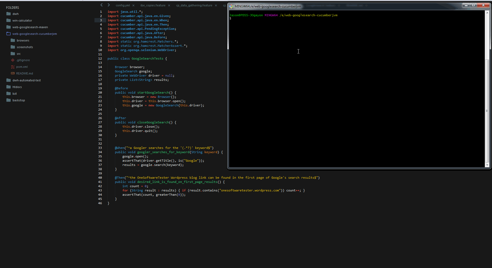
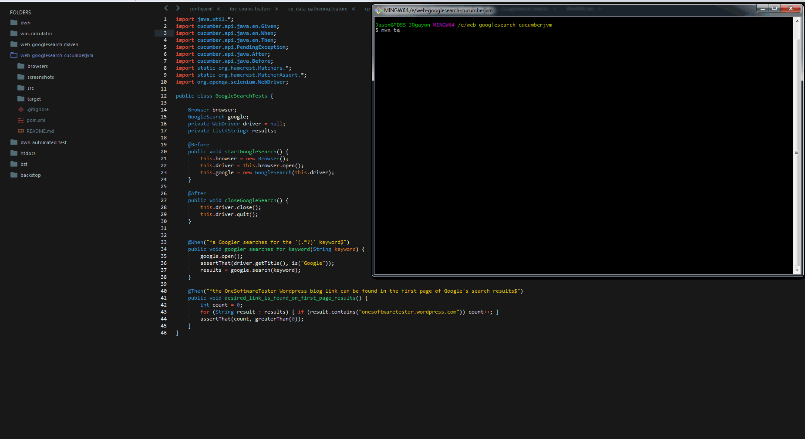

Web-GoogleSearch-CucumberJVM
============================

Source code for very basic Google Search automation example, using `Selenium WebDriver`, with code written in `Java` and dependencies managed by `Maven`. This example has an integration with `Cucumber-JVM` to provide a way of defining a test description language, in this case using the common `Given-When-Then` pattern. Test runs using the `mvn test` command, on a Google Chrome web browser by default, but can be set to run on Mozilla Firefox if desired.

**The Test:** Search for the `onesoftwaretester` keyword in Google and check if the first page results of the search contains links to the [OneSoftwareTester blog](https://onesoftwaretester.wordpress.com/).

## Steps

1. Install Java and Maven
2. Clone or download this repository
3. Open a terminal / command line of your choice and navigate to your local repo
4. Run `mvn test` to run the test on a Google Chrome browser, or
5. Run `mvn test -Denv.BROWSER=firefox` to run the same test on a Mozilla Firefox browser
6. Pass a `-Dcucumber.options="-t @onesoftwaretester"` command in the test if you want to try Cucumber-JVM's tag functionality

Author: **Jason Ogayon**